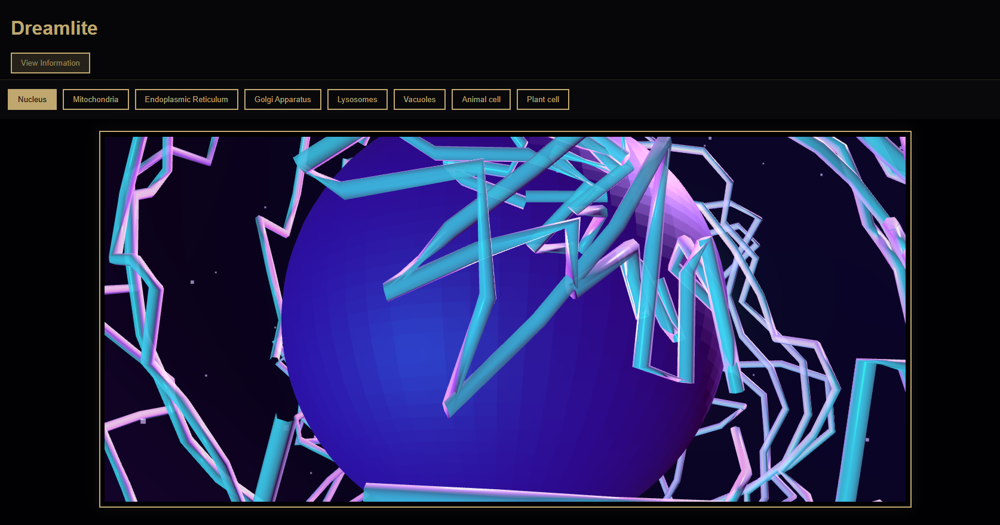
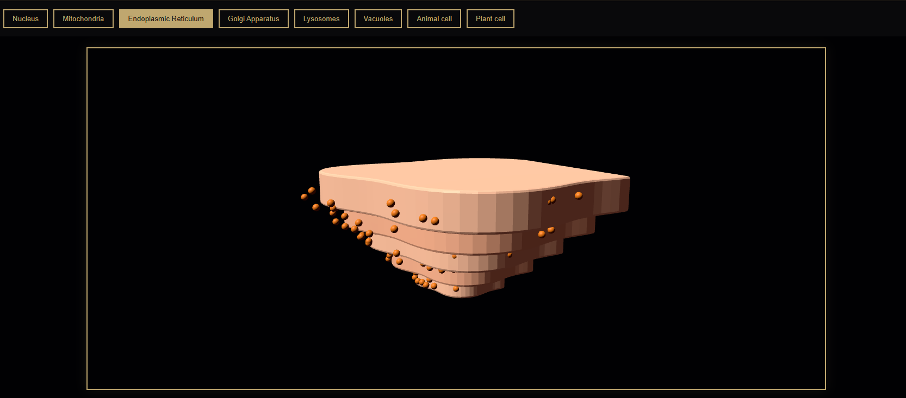
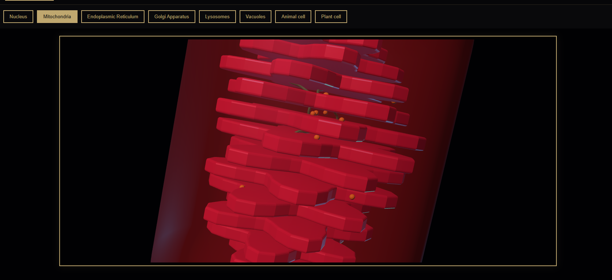
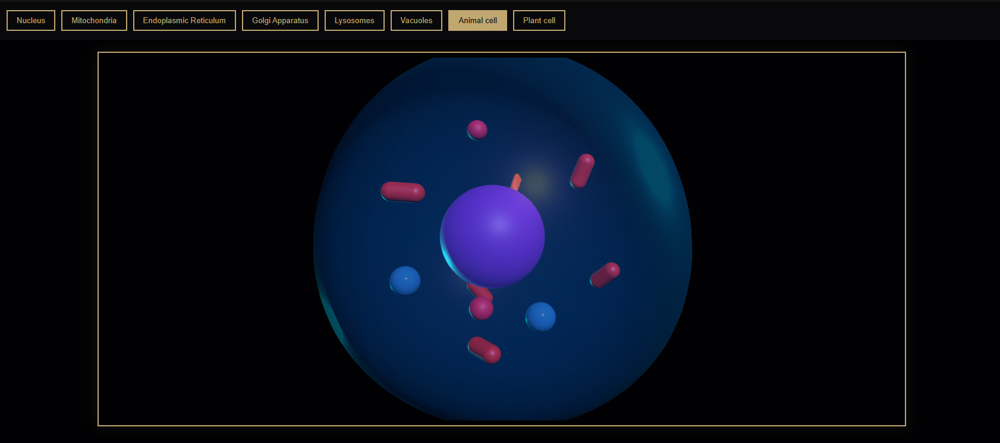

# Dreamlite

## Overview

Dreamlite is 3D visualisation of STEM diagrams so it helps learners understand concept well!

---

## Current Modules

### Science Module

The first visualisation is **Cell Organelles**. It consists of:

-Nucleus simulation with chromatin details.
-Endoplasmic reticulum with folded membrane.  
-Mitochondria with matrix and DNA animations.
-Golgi apparatus simulation with ribosome particles.
-Lysosomes simulation 
-Vacuoles simulation  
-Animal cell full system view  
-Plant cell full system view  

**2.Periodic table**

The periodic table is extended in another repository. Do checkout 


## Technology/Mathematics/Engineering Modules
 
Not implemented yet! But following are few ideas which will be implemented in future:

-3D graph visualization  
-Euclid Geometry visualisation
-Pythagores theorem visualisation
-Circuits


---

## Screenshots

### Nucleus


### Endoplasmic Reticulum


### Mitochondria


### Animal Cell


---

## How Modules Work

Each organelle is built as a separate JavaScript module

- Each module  
- Creates its own Three.js scene  
- Sets up its own camera and renderer  
- Builds geometry and materials  
- Runs its own animation loop  

*Modules are imported into a central main file and initialized when needed*

---

## Tech Stack

- Three.js
- Vanilla JavaScript 
- Svelte (Periodic table)
- HTML
- CSS
- Vite
- Vercel for deployment

---

## How to run?

Deployment available on: 

But to run locally , ensure you have Node.js installed on your system!

1. Clone the repository:
   ```bash
   git clone [https://github.com/sCherry1101/dreamlite.git](https://github.com/sCherry1101/dreamlite.git)
   ```

2. Navigate 
    ```bash
    cd dreamlite/dreamlite
    ```
3. Install dependencies 
    ```bash
    npm install
    ```
4. Run
    ```bash
    npm run dev
    ```

---

## Credits!

Special thanks to [@chwrryroll](https://github.com/chwrryroll) for the suggestions, development resources, and refrences regarding the project and Svelte :)
